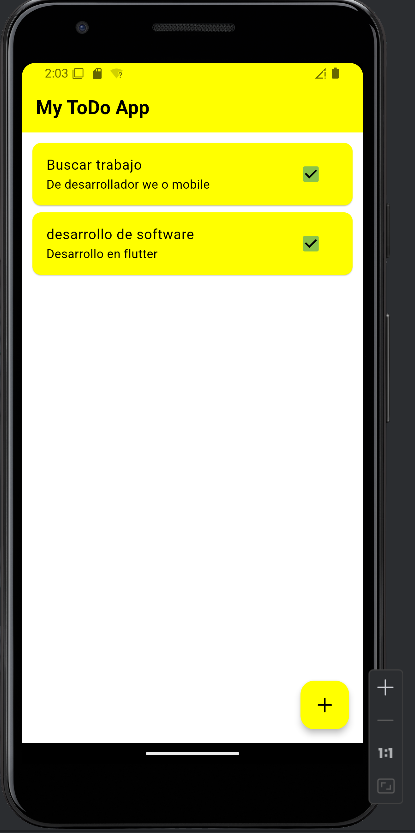
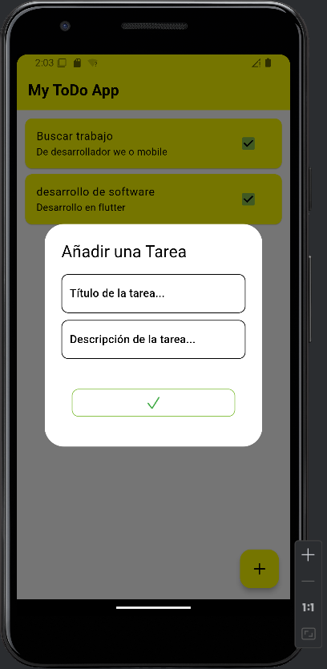
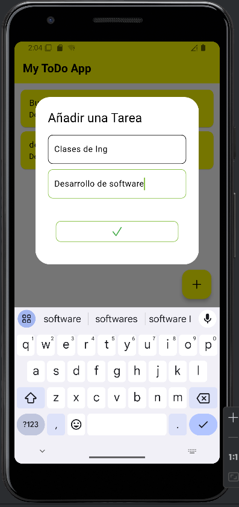
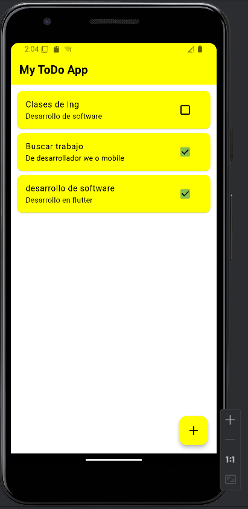
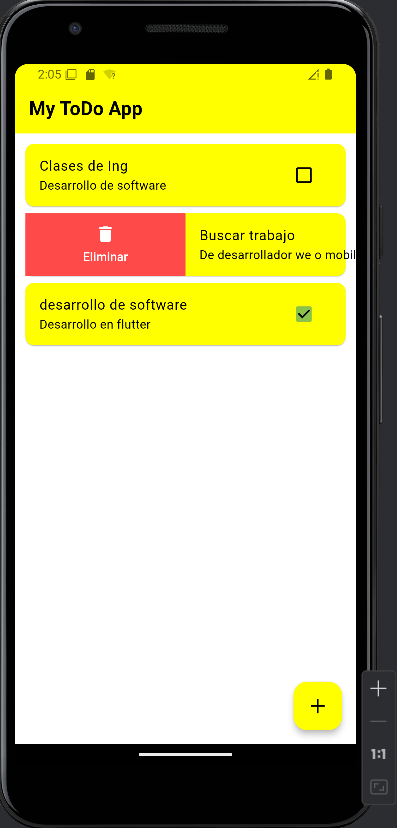
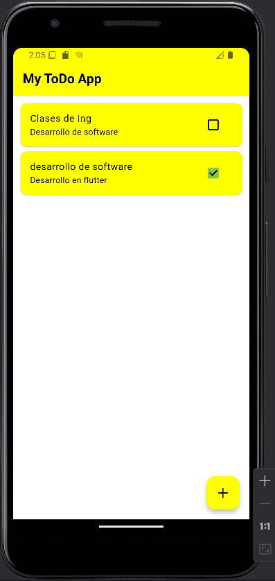

# Flutter Todo Clean

Una aplicación de CRUD Todo List implementada en Flutter siguiendo los principios de Clean Architecture y utilizando el patrón BLoC para la gestión del estado.
Este proyecto es una implementación de una aplicación de "Lista de Tareas" (Todo List) utilizando Clean Architecture en Flutter, 
junto con el patrón BLoC para gestionar el estado. La aplicación permite agregar, eliminar y modificar tareas en una lista. 
Utiliza la librería hydrated_bloc para persistencia del estado y equatable para comparar objetos de manera eficiente.

## 📱 Características

- Crear, editar y eliminar tareas
- Marcar tareas como completadas
- Persistencia de datos local
- Interfaz de usuario limpia y moderna
- Gestión de estado reactiva con BLoC
- Arquitectura limpia y mantenible

## 🏗️ Arquitectura

El proyecto sigue una arquitectura limpia con la siguiente estructura:

```
lib/
├── data/
│   └── todo.dart              # Modelo de datos Todo
│
├── todo_bloc/
│   ├── todo_bloc.dart         # Implementación del BLoC
│   ├── todo_event.dart        # Eventos del BLoC
│   └── todo_state.dart        # Estados del BLoC
│
├── home.dart                  # Pantalla principal
├── main.dart                  # Punto de entrada
└── simple_bloc_observer.dart  # Observer para debugging
```

### Capas de la Aplicación

1. **Capa de Datos (data/)**
    - `todo.dart`: Define el modelo de datos Todo con serialización JSON
    - Manejo de persistencia local

2. **Capa de Estado (todo_bloc/)**
    - Implementación del patrón BLoC
    - Manejo de eventos y estados
    - Lógica de negocio principal

3. **Capa de Presentación**
    - `home.dart`: UI principal de la aplicación
    - Widgets y componentes visuales

## 🛠️ Tecnologías Utilizadas

- Flutter
- flutter_bloc: ^8.1.4
- hydrated_bloc: ^9.1.4
- equatable: ^2.0.5
- path_provider: ^2.1.2

## 🚀 Instalación

1. **Clonar el repositorio**
```bash
git clone https://github.com/german654/myTodoapp
cd flutter_todo_clean
```

2. **Instalar dependencias**
```bash
flutter pub get
```

3. **Ejecutar la aplicación**
```bash
flutter run
```

## 📝 Uso

### Crear una nueva tarea
1. Presiona el botón flotante (+)
2. Ingresa el título y subtítulo de la tarea
3. Confirma para crear la tarea

### Editar una tarea
1. Presiona prolongadamente sobre la tarea
2. Modifica los campos necesarios
3. Guarda los cambios

### Completar una tarea
- Toca el checkbox junto a la tarea para marcarla como completada

### Eliminar una tarea
- Desliza la tarea hacia un lado para eliminarla

## 🧪 Testing

Para ejecutar las pruebas:
```bash
flutter test
```

## 📦 Estado Management

La aplicación utiliza el patrón BLoC para la gestión del estado con las siguientes características:

- **HydratedBloc**: Persistencia automática del estado
- **SimpleBlocObserver**: Logging y debugging de estados
- **Eventos principales**:
    - TodoStarted
    - TodoAdded
    - TodoDeleted
    - TodoUpdated
    - TodoToggled

## 🎨 Temas y Estilo

La aplicación utiliza un tema personalizado con:
- Esquema de colores claro
- Énfasis en accesibilidad
- Diseño material consistente

```dart
ColorScheme.light(
  surface: Colors.white,
  onSurface: Colors.black,
  primary: Colors.yellowAccent,
  onPrimary: Colors.black,
  secondary: Colors.lightGreen,
  onSecondary: Colors.white,
)
```

## 🤝 Contribuir

1. Fork el proyecto
2. Crea tu rama de características
   ```bash
   git checkout -b feature/AmazingFeature
   ```
3. Commit tus cambios
   ```bash
   git commit -m 'Add some AmazingFeature'
   ```
4. Push a la rama
   ```bash
   git push origin feature/AmazingFeature
   ```
5. Abre un Pull Request


## 🙏 Agradecimientos

- Flutter Team
- Bloc Library Contributors
- [Otros agradecimientos...]

## 🙏 Capturas de Pantalla






